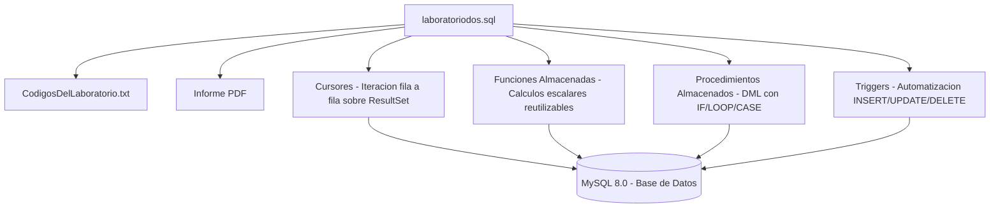

# Programación Avanzada SQL — Cursores, Funciones, Procedimientos y Triggers

> Desarrollo propio de programación procedimental en SQL: cursores, funciones almacenadas, procedimientos y disparadores para automatización de lógica de negocio.

## Descripción

---

Proyecto desarrollado por **Alejandro De Mendoza** que implementa las cuatro construcciones procedurales avanzadas de SQL para la automatización y encapsulamiento de lógica de negocio en la base de datos: **cursores** para iteración sobre resultados, **funciones almacenadas** para encapsular cálculos reutilizables, **procedimientos almacenados** para operaciones de manipulación masiva de datos, y **triggers** para automatización reactiva ante eventos DML.

## Construcciones implementadas

### Cursores
Permiten recorrer fila a fila un conjunto de resultados para procesamiento iterativo que no puede expresarse con consultas set-based.

### Funciones almacenadas
Encapsulan lógica de cálculo reutilizable (ej: cálculo de antigüedad, conversión de unidades, validaciones) devolviendo un valor escalar.

### Procedimientos almacenados
Agrupan múltiples sentencias DML/DDL con lógica de control de flujo (IF, LOOP, CASE) para operaciones transaccionales complejas.

### Triggers
Ejecutan acciones automáticamente ante eventos INSERT, UPDATE o DELETE en tablas específicas — auditoria, validaciones de negocio y sincronización de datos.

## Contenido del repositorio

| Archivo | Descripción |
|---|---|
| `laboratoriodos.sql` | Script SQL con cursores, funciones, procedimientos y triggers |
| `CódigosDelLaboratorio.txt` | Fragmentos de código del laboratorio |
| `Proyecto De Desarrollo*.pdf` | Informe con análisis y resultados de ejecución |

## Contexto académico

**Asignatura:** Bases de Datos · **Institución:** Ingeniería Informática
**Autor:** Alejandro De Mendoza — Ingeniero Informático · Especialista en Ingeniería de Software · Máster en Arquitectura de Software

---

## Arquitectura

## Autor

**Alejandro De Mendoza**  
Ingeniero Informático · Especialista en IA · Especialista en Ingeniería de Software · Máster en Arquitectura de Software

